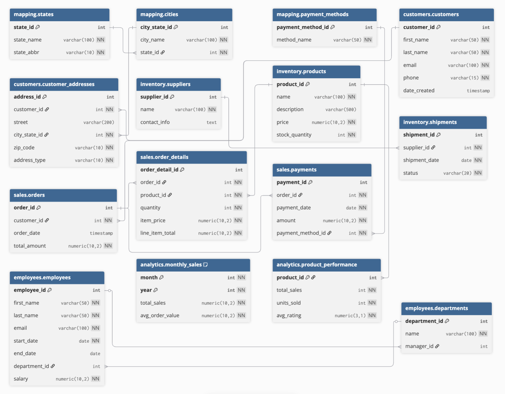

# ABC Store

## Table of Contents

1. [🚀 Project Overview + Quick Start](#project-overview--quick-start)
   - [What this project is](#what-this-project-is)
   - [Purpose](#purpose)
   - [What this project showcases](#what-this-project-showcases)
   - [Quick Start for SQL Practice](#quick-start-for-sql-practice)

2. [🧱 System Overview](#system-overview)
   - [Tech Stack](#tech-stack)
   - [Key Features](#key-features)
   - [Repository Structure](#repository-structure)
   - [Database Architecture](#database-architecture)
   - [Entity Relationship Diagram (ERD)](#entity-relationship-diagram-erd)

3. [⚙️ Data Pipeline & Design Philosophy](#data-pipeline--design-philosophy)
   - [Initialization Workflow](#initialization-workflow)
   - [Design Philosophy](#design-philosophy)
   - [Schema Design and Handwritten SQL](#schema-design-and-handwritten-sql)
   - [Python Data Generation Workflow](#python-data-generation-workflow)
   - [CSV Seeding Strategy](#csv-seeding-strategy)
   - [Circular Foreign Key Handling](#circular-foreign-key-handling)

4. [🧩 Database Logic](#database-logic)
   - [Business Rules Overview](#business-rules-overview)
   - [Triggers](#triggers)
   - [Constraints](#constraints)
   - [Indexing Strategy](#indexing-strategy)

5. [🧠 SQL Practice Curriculum](#sql-practice-curriculum)
   - [Curriculum Overview](#curriculum-overview)
   - [Learning Modules](#learning-modules)
   - [Real-World SQL Problems](#real-world-sql-problems)
   - [Data Quality Checks](#data-quality-checks)
   - [Performance Tuning with EXPLAIN](#performance-tuning-with-explain)

6. [🔮 Future Improvements](#future-improvements)

## Project Overview + Quick Start

### What this project is

ABC Store is a realistic, multi-schema PostgreSQL database project built to simulate a small business environment for hands-on SQL practice, featuring realistic business domains- customers, sales, inventory, employees, analytics

It is packaged with Docker for consistent local setup, and includes a relational database designed for querying, analysis, and database design exploration, and a structured SQL practice curriculum.

### Purpose

- Create a practical SQL learning environment using a realistic relational database.
- Showcase core data engineering principles such as data modeling, 3NF normalization, data integrity, reproducible setup, modular design for maintainability, indexing, and clear error handling with informative messages.

### What this project showcases

- **Data modeling** through a structured multi-schema PostgreSQL design.
- **3NF normalization** to reduce redundancy and improve data integrity.
- **Data engineering principles** through reproducible database initialization, seed workflows, and environment portability with Docker.
- **Modularity** for maintainability by separating schema creation, seed generation, seed loading, and business logic into distinct parts.
- **Data integrity enforcement** using primary keys, foreign keys, constraints, functions, and triggers.
- **Performance awareness** through index usage and query optimization considerations.
- **Error handling with clear messages** in Python and database workflows to make debugging easier and setup more reliable.
- **A realistic SQL practice environment** for joins, aggregations, subqueries, CTEs, and other intermediate-to-advanced querying patterns.

### Quick Start for SQL Practice

If your goal is to start querying right away, follow the steps below.

#### 1. Install Docker

- Download and install **Docker Desktop**[/https://www.docker.com/products/docker-desktop/].
- Open Docker Desktop after installation.
- Confirm Docker is running before starting the project.

> This project runs through Docker containers, so Docker must be installed before starting the database.

#### 2. Start the Project

From project root, run:

```bash
docker compose up --build
```

What This Command Does:

- Starts a **PostgreSQL** database in Docker.
- Loads the database **schema**.
- Seeds the database with **sample data**.
- Creates **functions, triggers, and indexes**.
- Starts **Adminer** for browser-based SQL access.

#### 4. Access the Database

##### Option A: Adminer

Open in your browser: [http://localhost:8080](http://localhost:8080)

Use these login settings:

- **System:** PostgreSQL
- **Server:** db
- **Username:** postgres
- **Password:** postgres
- **Database:** abc_store

##### Option B: SQL Client

Use any SQL client such as **DBeaver**.

**Connection settings:**

- **Host:** localhost
- **Port:** 5432
- **Database:** abc_store
- **Username:** postgres
- **Password:** postgres

#### 5. Stop the Project

**Stop container(s):**

```bash
docker compose down
```

**Stop container(s) and remove persisted data:**

```bash
docker compose down -v
```

#### 6. Start Practicing SQL

A [SQL Practice Curriculum](#sql-practice-curriculum) is included with this repo.

### Notes

- This project is intended for **local learning** and portfolio demonstration.
- Default credentials are kept simple for quick local setup.
- **Do not** use these credentials in any production or internet-exposed environment.

## System Overview

This section gives a fast orientation to how the project is built and what it demonstrates.

### Tech Stack

- **SQL** for schema design, constraints, triggers, functions, and indexing
- **PostgreSQL** for the relational database
- **Python** for dummy data generation and seed export workflows
- **Docker** for containerized setup
- **Docker Compose** for multi-container orchestration
- **Adminer** for browser-based database access
- **CSV seed files** for reproducible database initialization

### Key Features

- **Multi-schema database design** to organize data by business domain
- **3NF normalization** to reduce redundancy and improve data integrity
- **Dockerized setup** for consistent local deployment
- **Seeded relational data** for realistic SQL practice
- **Business logic in the database** using functions and triggers
- **Indexing strategy** to support performance-aware querying
- **Modular project structure** for maintainability and clarity
- **Error handling with clear messages** in Python setup workflows
- **Adminer access** for quick browser-based querying

### Repository Structure

```text
project-root/
├── abc_store/           # Python toolkit for data generation, export, validation, and utilities
├── db/init              # Container initialization script run during first-time database setup
├── notebooks/           # Development and exploratory notebooks used during project buildout
├── scripts/             # Lightweight orchestration scripts
├── sql/                 # SQL files for schemas, tables, functions, triggers, and indexes
├── seed_data/           # CSV seed files loaded into PostgreSQL
├── docker-compose.yml   # Container orchestration
├── Dockerfile           # Optional custom image build steps
├── Makefile             # Common local commands
├── .env.example         # Example environment variables
└── README.md            # Project documentation
```

### Database Architecture

The database is organized into multiple schemas to reflect separate business domains and support realistic relational querying.

Current schemas and tables:

```text
mapping/
├── states
├── cities
└── payment_methods

customers/
├── customers
└── customer_addresses

inventory/
├── products
├── suppliers
└── shipments

sales/
├── orders
├── order_details
└── payments

employees/
├── employees
└── departments

analytics/
├── monthly_sales
└── product_performance
```

**This structure helps demonstrate:**

- Domain-based organization
- Relational modeling across schemas
- Foreign key relationships between business entities
- More realistic SQL querying than a single flat schema

### Entity Relationship Diagram (ERD)

The ERD provides a visual overview of:

- Tables across each schema
- Primary keys
- Foreign keys
- Relationships between core business entities



## Data Pipeline & Design Philosophy

This section explains how the database is initialized, how seed data is produced, and why the project was structured this way.

### Initialization Workflow

The database is initialized in a deliberate sequence so that dependencies, business logic, and circular relationships are handled cleanly.

Initialization order:

1. Create schemas  
2. Create tables  
3. Load seed data  
4. Create functions and triggers  
5. Apply circular foreign key updates  

This workflow helps ensure:

- Tables exist before data is loaded
- Seed data loads in dependency-aware order
- Business logic is applied after base data is in place
- Circular relationships are resolved without breaking initialization

### Design Philosophy

The project was designed to be both a practical SQL sandbox and a small end-to-end data system.

Core design choices:

- Use **handwritten SQL** for transparency and control
- Keep **schema design**, **data generation**, and **seed loading** separate
- Make the environment **reproducible** through Docker and CSV seeding
- Prioritize **modularity for maintainability**
- Include **error handling with clear messages** to make setup and debugging easier
- Build around realistic relational patterns instead of simplified toy examples

The goal was not just to populate tables, but to build a system that reflects core data engineering principles such as data modeling, integrity enforcement, reproducibility, and structured initialization.

### Schema Design and Handwritten SQL

The schema and table definitions are written by hand rather than generated from a raw database dump.

This approach makes the project easier to:

- Read
- Review
- Maintain
- Explain in interviews
- Extend over time

It also keeps the initialization flow intentional, with separate SQL files for:

- Schema creation
- Table creation
- Seed loading
- Functions and triggers
- Post-load relationship fixes

### Python Data Generation Workflow

Python is used to generate realistic dummy data before that data is exported into CSV seed files.

This workflow allows the project to separate:

- **Data creation logic** from
- **Database initialization logic**

Benefits of this approach:

- Data generation code is easier to test and adjust
- Seed files can be reused without rerunning generation every time
- The Docker setup stays focused on loading an existing dataset
- The project shows both database design and supporting pipeline logic

The Python portion of the project also reflects software engineering practices such as modularity, reuse, and readable error handling.

### CSV Seeding Strategy

Seed data is loaded from CSV files rather than being inserted row-by-row during container startup.

Why CSV seeding was used:

- It makes initialization more reproducible
- It keeps the Docker startup flow simpler
- It separates one-time data generation from repeated database setup
- It is easier to inspect and validate seed inputs
- It mirrors a lightweight batch-loading workflow

In this design:

- Python generates and exports the seed data
- PostgreSQL loads the CSV files during initialization
- The seeded database can be recreated consistently across environments

### Circular Foreign Key Handling

One part of the schema includes a circular relationship between employees and departments.

Specifically:

- Employees belong to departments
- Departments reference a manager
- That manager is also an employee

To handle this cleanly, the relationship is resolved in a later step rather than during the first table load.

Approach used:

1. Create the related tables  
2. Load the base department and employee records  
3. Apply a post-load update to connect department managers  

This avoids initialization failures while still preserving the intended relational design.

It also reflects a real-world database concern: sometimes schema relationships are valid, but they must be loaded in stages.

## Database Logic

This section highlights the business rules built into the database to help maintain accuracy, consistency, and realistic system behavior.

### Business Rules Overview

The project includes database-level logic to simulate how a real transactional system enforces core rules beyond simple table structure.

These rules help ensure that:

- Order details are populated consistently
- Inventory is adjusted when order activity occurs
- Order totals stay aligned with line items
- Payments match the corresponding order amounts
- Relational data remains valid through constraints and foreign keys
- Query performance is supported through targeted indexing

This logic helps move the project beyond static table design and into real system behavior.

### Triggers

The database uses functions and triggers to automate key parts of transactional logic.

Current trigger-driven workflows include:

- **Autofill order details** to populate dependent values when needed
- **Stock management** to update inventory levels based on order activity
- **Order total synchronization** to keep order totals aligned with related line items
- **Payment validation** to ensure payment amounts match the corresponding order totals

These triggers help enforce consistency at the database level rather than relying entirely on external application code.

### Constraints

Constraints are used throughout the database to protect data integrity and enforce valid relationships.

These include:

- **Primary keys** to uniquely identify records
- **Foreign keys** to maintain valid relationships across schemas
- **Not-null constraints** for required fields
- **Check constraints** where appropriate to restrict invalid values

This helps ensure that the database structure itself prevents many common data issues before they can enter the system.

### Indexing Strategy

Indexes are used on selected columns to support more efficient querying and reinforce performance-aware database design.

The indexing strategy is intended to:

- Improve lookup and join performance on commonly queried fields
- Support realistic SQL practice with performance considerations in mind
- Demonstrate the tradeoff between faster reads and added write overhead

This section of the project is meant to show not just how queries are written, but how database design choices can affect query performance.

## SQL Practice Curriculum

This project is designed to be more than a database build. It is also a structured SQL practice environment built around realistic business data and progressively harder query patterns.

### Curriculum Overview

The curriculum is organized to move from foundational querying to more advanced analytical and performance-focused SQL.

Progression:

1. Foundations  
2. Joins  
3. Aggregation  
4. Subqueries  
5. CTEs  
6. Window Functions  
7. Set Operations and `CASE`  
8. Performance and Indexing  
9. Capstone Challenges  

The goal is to build repeatable practice with increasing difficulty while reinforcing query clarity, data quality checks, and performance awareness.

### Learning Modules

#### 1. Foundations

Focus areas:

- Basic `SELECT`, `WHERE`, and `ORDER BY`
- Foreign key awareness across related tables
- Date/time functions
- Type casting
- Arithmetic and derived columns

Example practice:

- Newest customers added
- Orders placed in the last 7 days
- Basic calculated fields from transactional tables

#### 2. Joins

Focus areas:

- `INNER JOIN`
- `LEFT JOIN`
- `RIGHT JOIN`
- `FULL JOIN`
- Anti-join patterns using `LEFT JOIN ... IS NULL`
- Anti-join patterns using `NOT EXISTS`

Example practice:

- Customers and their orders
- Products and related order activity
- Suppliers with no recent shipments
- Customers with no purchase history

#### 3. Aggregation

Focus areas:

- `GROUP BY`
- `HAVING`
- Multi-level grouping
- Summary KPI queries

Example practice:

- Revenue by day, week, and month
- Average order value
- Repeat vs. new customers
- Supplier- or product-level sales summaries

#### 4. Subqueries

Focus areas:

- Subqueries in `WHERE`
- Subqueries in `FROM`
- Correlated subqueries
- Semi-joins and anti-joins

Example practice:

- Top customers by spend
- Entities with no recent activity
- Products above average sales thresholds
- Top-N per group patterns

#### 5. CTEs

Focus areas:

- Replacing deeply nested subqueries
- Building multi-step query pipelines
- Improving readability for complex logic

Example practice:

- Staged filtering and aggregation
- Multi-step order and revenue summaries
- Reusable intermediate calculations

#### 6. Window Functions

Focus areas:

- `ROW_NUMBER`
- `RANK`
- `DENSE_RANK`
- `NTILE`
- `LAG` / `LEAD`
- Running totals
- Moving averages

Example practice:

- Top products per category
- Month-over-month sales changes
- Ranked customers by spend
- Rolling revenue trends

#### 7. Set Operations and `CASE`

Focus areas:

- `UNION`
- `UNION ALL`
- `INTERSECT`
- `EXCEPT`
- `CASE WHEN` for flags, tiers, and bucketing

Example practice:

- Customer tiering
- Order value segmentation
- Combining historical result sets
- Flagging repeat customers or churn-risk groups

#### 8. Performance and Indexing

Focus areas:

- Reading query plans with `EXPLAIN`
- Using `EXPLAIN ANALYZE`
- Understanding access paths
- Evaluating when indexes help
- Comparing before/after query performance

Example practice:

- Tune slow join queries
- Compare indexed vs. non-indexed filtering
- Test composite index impact on reporting queries

#### 9. Capstone Challenges

Capstone exercises combine multiple concepts into larger business-style problems.

Example capstones:

- Rolling 28-day revenue and month-over-month growth
- Top products by category with tie-safe ranking
- Repeat customer rate and churn candidates
- Shipment cycle times and stockout risk
- Headcount trends and span-of-control analysis

### Real-World SQL Problems

The curriculum is designed around realistic business questions rather than isolated syntax drills.

Examples include:

- Which customers have not placed an order recently?
- Which products generate the most revenue?
- Which suppliers have open shipment gaps?
- Which departments have grown or shrunk over time?
- Which queries become faster after indexing?

This makes the project useful both for SQL practice and for demonstrating analytical thinking on top of a relational system.

### Data Quality Checks

Data quality checks are integrated into SQL practice rather than treated as a separate topic.

Common checks include:

- Missing foreign key relationships
- Unexpected null values
- Duplicate records
- Mismatched order totals
- Invalid payment or shipment patterns

This reinforces the habit of validating data before trusting query outputs.

### Performance Tuning with EXPLAIN

Performance tuning is part of the later curriculum to encourage query optimization habits, not just query correctness.

Key practices include:

- Using `EXPLAIN` to inspect execution plans
- Using `EXPLAIN ANALYZE` to compare actual execution behavior
- Testing indexes against real query patterns
- Reviewing tradeoffs between readability and speed

This helps connect SQL writing with practical database performance thinking.

## Future Improvements

Potential future additions include:

- Adding more advanced SQL practice challenges and performance exercises
- Extending the analytics layer with additional reporting tables or dashboard outputs
- Exploring audit logging for change tracking in transactional tables
